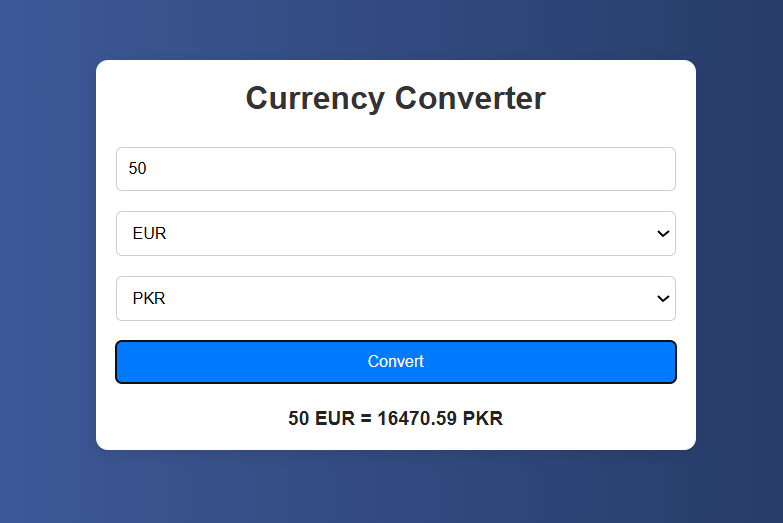

# Vanilla JS Currency Converter

A simple and responsive Currency Converter built using HTML, CSS, and Vanilla JavaScript. This project allows users to convert amounts between different currencies using predefined exchange rates.

## Features

* Convert between USD, EUR, GBP, and PKR
* Responsive design for desktop, tablet, and mobile devices
* Clean and modern user interface
* Built with pure HTML, CSS, and JavaScript
* No external libraries or frameworks required

## Screenshot



## Technologies Used

* HTML5
* CSS3
* JavaScript (ES6)

## Project Structure

```text
vanilla-js-currency-converter/
│
├── index.html
├── style.css
├── script.js
├── screenshot.png
└── README.md
```

## Installation

Clone the repository:

```bash
git clone https://github.com/Areej39/vanilla-js-currency-converter.git
```

Navigate to the project directory:

```bash
cd vanilla-js-currency-converter
```

Open `index.html` in your preferred web browser.

## Usage

1. Enter an amount.
2. Select the source currency.
3. Select the target currency.
4. Click the **Convert** button.
5. View the converted amount instantly.

## How It Works

The application uses predefined exchange rates stored in a JavaScript object. The entered amount is first converted to a base currency (USD) and then converted to the selected target currency.

## Future Improvements

* Integrate a live exchange rate API
* Add support for additional currencies
* Include currency symbols and flags
* Add dark mode functionality

## Author

Areej Fatima

GitHub: https://github.com/Areej39

Live Demo: https://areej39.github.io/vanilla-js-currency-converter/
